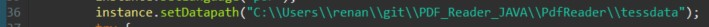
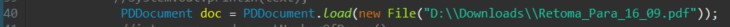
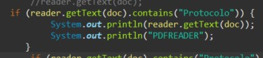
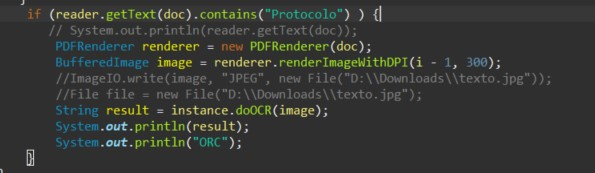
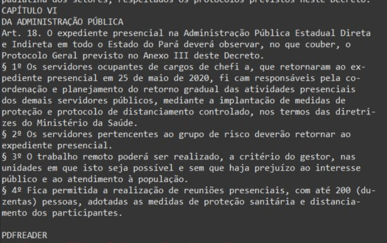
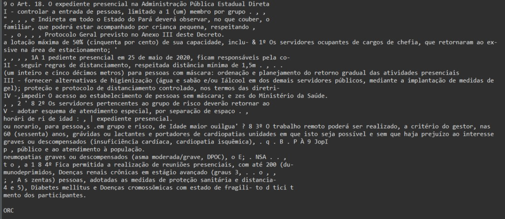

<h1>:page_with_curl: PDF and Image Reader :page_with_curl: </h1>

## Requirements
- PdfBox
- Tess4J-3.4.8

## installation

Clone this repository with the command:

`$ git clone https://github.com/rnanc/PDF_Reader_JAVA.git`

Import as a `maven project` and wait for it to build dependencies

Change this path to your the right one for you system, this folder comes inside the project.

## Usage

Insert the file you would like to read

Search for a word in PdfBox method:

Search for a word in OCR method:

## Outcome

Check your console for both outcomes:

### PDFBOX

### OCR

> Results for OCR may vary on color, quality or dpi settings for the pdf or image file affecting the final result
